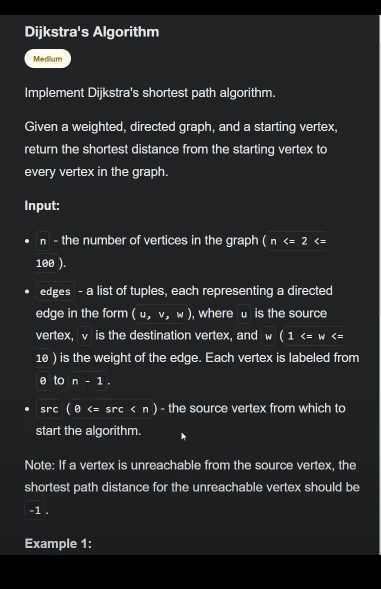
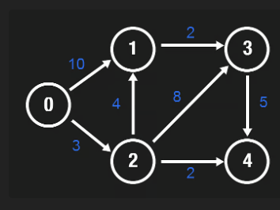

# Graph

## Common graph alogrithms and patterns.

### 1. Breadth-First Search (BFS)

- BFS is useful for find the shortest path in an unweighted graph, level order
  traversal, and for problems where you need to explore neighbors first.

Example Problems:

- Word Ladder
- Binary Tree Level Order Traversal

```python
def bfs(graph, start):
    queue = deque([start])
    visited = set([start])

    while queue:
        node = queue.popleft()
        # Process the node here
        for nei in graph[node]:
            if nei not in visited:
                visited.add(nei)
                queue.append(nei)
```

### 2. Depth-First Search (DFS)

- DFS is useful for path finding, topological sorting, and detecting cycles in a
  graph. Example Problems:
- Number of Islands
- Course Schedule

```python
def dfs(graph, start, visited):
    visited.add(start)
    # process the node here
    for nei in graph[start]:
        if nei not in visited:
            dfs(graph, nei, visited)
```

### 3. Union-Find

- Union-Find is useful for solving connectivity problems like finding connected
  components, detecting cycles, and kruskal's algorithm for Minimum Spanning
  Tree (MST). Example Problem:
- Graph valid tree
- Number of connected components in an undirected graph

```python
class UnionFind:
    def __init__(self, size):
        self.root = [i for i in range(size)]
        self.rank = [1] * size

    def find(self, x):
        if self.root[x] == x:
            return x
        self.root[x] = self.find(self.root[x]) # path compression
        return self.root[x]

    def union(self, x, y):
        rootX = self.find(x)
        rootY = self.find(y)

        if rootX != rootY:
            if self.rank[rootX] > self.rank[rootY]:
                self.root[rootY] = rootX
            elif self.rank[rootX] < self.rank[rootY]:
                self.root[rootX] = rootY
            else:
                self.root[rootY] = rootX
                self.rank[rootX] += 1
# usage
uf = UnionFind(n)
uf.union(0, 1)
uf.find(1)
```

### 4. Topological Sorting (Kahn's Algorithm)

- Topological Sorting is used for problems related to scheduling, ordering of
  tasks, and resolving dependencies. Example Problems
- Course Schedule II
- Alien Dictionary

```python
from collections import deque, defaultdict

def topological_sorting(vertices, edges):
    in_degree = {i: 0 for i in range(vertices)}
    graph = defaultdict(list)

    for u, v in edges:
        graph[u].append(v)
        in_degree[v] += 1

    queue = deque([node for node in in_degree if in_degree[node] == 0])
    topo_order = []

    while queue:
        node = node.popleft()
        topo_order.append(node)

        for nei in graph[node]:
            in_degree[nei] -= 1
            if in_degree[nei] == 0:
                queue.append(nei)
    return topo_order if len(topo_order) == vertices else []
# usage
vertices = 4
edges = [(0, 1), (1,2), (2,3)]
topological_sorting(vertices, edges)
```

### 5. Dijkstra's Algorithm

- Dijkstra's Algorithm is used for finding the shortest path in a graph with
  non-negative wieghts..

#### Example Problems:

- Network Delay Time
- Cheapest Flights Within K Stops

 

```python
class Solution:
  def shortestPath(self, n: int, edges: List[List[int]], src: int) -> Dict[int, int]:
    adj = {}
    for i in range(n):
      adj[i] = []
    for s, d, weight in edges:
      adj[s].append([d, weight])
    shortest = {} # Map vertex -> dist of shortest path
    minHeap = [[0, src]]
    while minHeap:
      w1, n1 = heapq.heappop(minHeap)
      if n1 in shortest:
        continue
      shortest[n1] = w1
      for n2, w2 in adj[n1]:
        if n2 not in shortest:
          heapq.heappush(minHeap, [w1 + w2, n2])
    for i in range(n):
      if i not in shortest:
        shortest[i] = -1
    return shortest
```

```python
import heapq

def dijkstra(graph, start):
    min_heap = [(0, start)]
    distances = {node: float('inf') for node in graph}
    distances[start] = 0

    while min_heap:
        current_distance, node = heapq.heappop(min_heap)

        if current_distance > distances[node]:
            continue
        for nei, weight in graph[node]:
            distance = current_distance + weight

            if distance < distance[nei]:
                distances[nei] = distance
                heapq.heappush(min_heap, (distance, nei))
    return distances
```

### 6. Bellman-Ford Algorithm

- Bellman-Ford is used for finding the shortest path in a graph with negative
  weights and detecting negative wiehgt cycles. Example Problem
- Negative Weight Cycle
- Cheapest Flights Within K Stops

```python
def bellman_ford(vertices, edges, start):
    distances = [float("inf")] * vertices
    distances[start] = 0

    for _ in range(vertices - 1):
        for u, v, weight in edges:
            if distances[u] != float("inf") and distances[u] + weight < distances[v]:
                distances[v] = distances[u] + weight
    # check for negative weight cycles
    for u, v, weight in edges:
        if distances[u] != float("inf") and distances[u] + weight < distances[v]:
            return "Graph contains negative weight cycle"
    return distances
# usage
vertices = 5
edges = [(0, 1, -1), (0, 2, 4), (1, 2, 3), (1, 3, 2), (1, 4, 2), (3, 2, 5), (3, 1, 1), (4, 3, -3)]
bellman_ford(vertices, edges, 0)
```

### 7. Floyd-Warshall Algorithm

Floyd-Warshall is used for finding the shortest paths between all pairs of
vertices in a weighted graph.

```python
def floyd_warshall(graph):
    dist = [[float('inf')] * len(graph) for _ in range(len(graph))]

    for i in range(len(graph)):
        for j in range(len(graph)):
            if i == j:
                dist[i][j] = 0
            elif graph[i][j] != 0:
                dist[i][j] = graph[i][j]

    for k in range(len(graph)):
        for i in range(len(graph)):
            for j in range(len(graph)):
                dist[i][j] = min(dist[i][j], dist[i][k] + dist[k][j])
    return dist
# Usage
graph = [
    [0, 3, float('inf'), 5],
    [2, 0, float('inf'), 4],
    [float('inf'), 1, 0, float('inf')],
    [float('inf'), float('inf'), 2, 0]
]
floyd_warshall(graph)
```

Four graph algorithm solution:

## Dijkstra's Algorithm

Dijkstra's algorithm is a graph search algorithm that finds the shortest paths
between nodes in a graph. It is particularly effective for find the the shortest
path from a single source node to all other nodes in graph with non-negative
edge weights.

The algorithm uses a greedy strategy, maintaining a set of vertices whose
shortest distance from the source is known. At each step, it selects the vertex
with the minimum distance value from the set of unvisited vertices.

We initialize distances to all vertices as infinity, except for the source
vertex, which is set to zero. A priority queue is used to efficiently select the
vertex with the minimum distance in each iteration, ensuring that the most
promising paths are processed first and saving unnecessary computations.

For each neighbor of the current vertex, we calculate the distance through the
current vertex. If this calculated distance is less than the previously known
distance to that neighbor, the distance is updated - a process known as
relaxation. Dijkstra's algorithm performs relaxation efficiently by always
processing the most promising vertex next.

## Bellman-Ford Algorithm

The Bellman-Ford algorithm is a graph search algorithm that finds the shortest
paths from a single source vertex to all other vertices in a weighted graph.
Unlike Dijkstra's algorithm, Bellman-Form can handle graphs with negative edge
weights, making it more versatile but potentially slower.

## Shortest Path First Algorithm (SPFA)

The Shortest Path Faster Algorithm (SPFA) is an improvement of the Bellman-Ford
algorithm, designed to work faster on average, especiall for sparse graphs,
while still handling negative edge weights.

SPFA starts similarly to Bellman-Ford by initializing all distances to infinity
except for the source vertex. However, instead of blindly relaxing all edges in
each iteration, SPFA uses a queue to keep track of which vertices need to be
processed. We begin by adding the source vertex to the queue, then enter a loop
that continues as long as the queue is not empty. In each iteration, we remove a
vertex from the queue and relax its outgoing edges. If relaxing an edge updates
the distance to a neighbor, we add that to the queue if it's not already there.

This queue based approach allows SPFA to focus on the parts of the graph where
improvements are still possible, potentially speaking large portions of the
graph that won't lead to better paths. This targeted processing often makes SPFA
faster than Bellman-Ford in practice.

## Floyd-Warshall Algorithm

The Floyd-Warshall algorithm finds the shortest paths in a weighted graph with
positive or negative edge weights, as long as there are no negative cycles.
Unlike algorithms that compute shortest paths from a single source,
Floyd-Warshall computes the shortest paths between all pairs of vertices in the
graph

This algorithm takes a fundamentally different approach by computing all-pairs
shortest paths in one go, rather than seperately for each source. We start by
initializing a distance matrix where direct connections between cities are
filled with their edge weights, and all other distances are set to infinity. The
distance from a city to itself is set to zero. This matrix serves both as our
working space and our final result.
