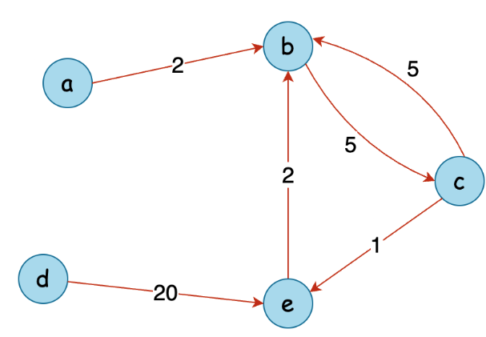

# https://leetcode.com/problems/minimum-cost-to-convert-string-i/?envType=daily-question&envId=2024-07-27

source and target, original and changed cost, where cost[i] represents the cost
of changing the character original[i] to the character changed[i].

source = "abcd" target = "acbe" orginal = ["a","b","c","c","e","d"] changed =
["b","c","b","e","b","e"] cost = [ 2, 5, 5, 1 , 2, 20] b -> c: 5 c -> e: 1 e ->
b: 2 d -> e: 20 total_cost: 28

Overview We have strings, source and target, both at the same length.
Additionaly, we have three arrays: original, changed, and cost, each also of the
same length.

Our task is to transform the source text into the target text using a series of
character conversions. Each conversion works as follows:

1. Identify a character in source that does not match the corresponding
   character in target.
2. Find the mismatched character in the original array.
3. Replace it with the corresponding character from the changed array.
4. Each conversion has a cost specified in the cost array.

The goal is to determine the minimum total cost required to transform source
into target.

Approach 1: Dijkstra's Algorithm Intuition Our task is to convert each
mismatched character at the lowest possible cost. To tackle this, we can model
each character as a node in graph, with transformations represented as directed
edges between nodes, each with a specific cost. The problem then becomes finding
the minimum cost path from each character in source to the corresponding
character in target.

- 

```python
class Solution:
    def minimumCost(self, source: str, target: str, original: List[str], changed: List[str], cost: List[int]) -> int:
        # create a graph representation of character conversions
        adjacency_list = [[] for _ in range(26)]
        # populate the adjcency list with character conversions
        conversion_count = len(original)
        for i in range(conversion_count):
            adjacency_list[ord(original[i]) - ord("a")].append(
                (ord(changed[i]) - ord("a"), cost[i])
            )
        # print(adjacency_list) [[(1, 2)], [(2, 5)], [(1, 5), (4, 1)], [(4, 20)], [(1, 2)], [], [], [], [], [], [], [], [], [], [], [], [], [], [], [], [], [], [], [], [], []]
        # calculate shortest paths for all possible character conversions
        min_conversion_costs = [
            self._dijkstra(i, adjacency_list) for i in range(26)
        ]
        # calculate the total cost of converting source to target
        total_cost = 0
        for s, t in zip(source, target):
            if s != t:
                char_conversion_cost = min_conversion_costs[ord(s) - ord("a")][
                    ord(t) - ord("a")
                ]
                if char_conversion_cost == float("inf"):
                    return -1 # conversion not possible
                total_cost += char_conversion_cost
        return total_cost
    def _dijkstra(
        self, start_char: int, adjacency_list: List[List[tuple]]
    ) -> List[int]:
        # priority queue to store characters with their conversion cost, sorted by cost
        priority_queue = [(0, start_char)]
        # list to store the minimum conversion cost to each character
        min_costs = [float("inf")] * 26
        while priority_queue:
            current_cost, current_char = heapq.heappop(priority_queue)
            if min_costs[current_char] != float("inf"):
                continue
            min_costs[current_char] = current_cost
            # explore all possible conversions from the current character
            for target_char, conversion_cost in adjacency_list[current_char]:
                new_total_cost = current_cost + conversion_cost
                # if we found a cheaper conversion, update its cost
                if min_costs[target_char] == float("inf"):
                    heapq.heappush(
                        priority_queue, (new_total_cost, target_char)
                    )
        # return the list of minimum conversion costs from the starting character to all others
        return min_costs
```
