# Dynamic Programming

## Climbing stairs

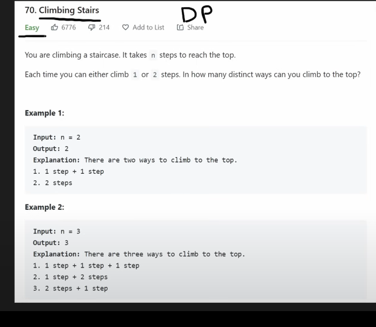

- take 1 or 2 step

### recursion dfs and cache/memoization

- decision tree dfs: 2n 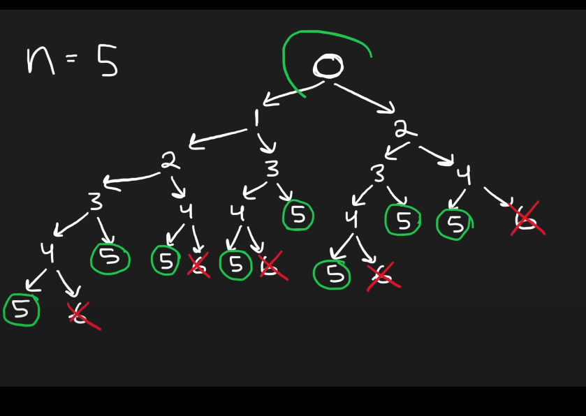
- how to avoid repeated steps?
  - **cache/memoization**: time: O(n) - n = 1 to n-1 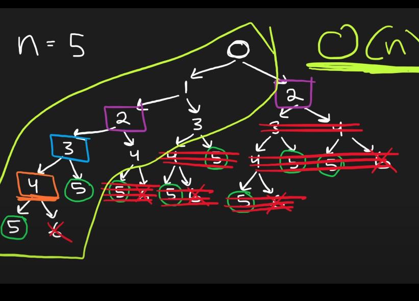

### DP solution

- solution depends on subproblem
- DP bottom up
- add 2 previous number to get current value, just like fibonacci.
  - 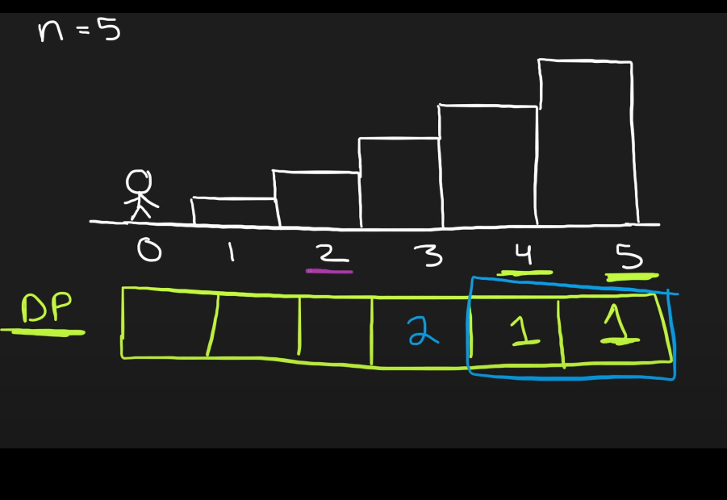
  - 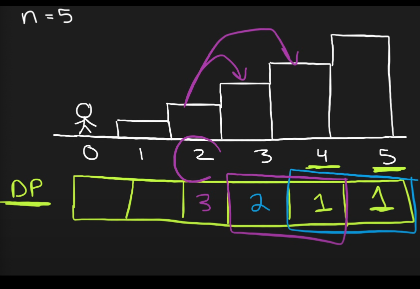
  - 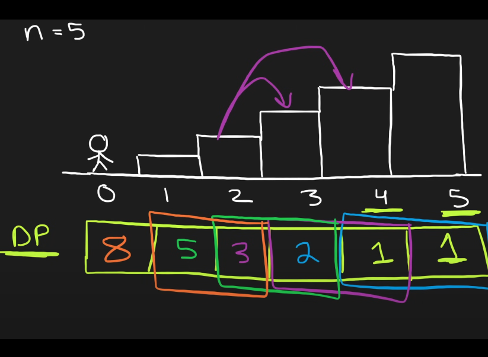
- no memory need,use two variables the last two, shift variable
  - 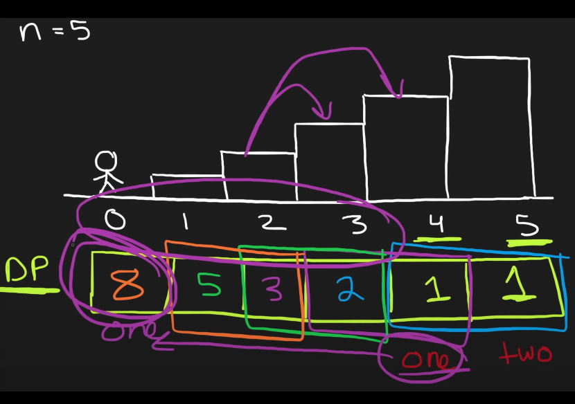

<details>
<summary>Solution</summary>
<br>
<!-- We need a space between the <br> and the content -->

```python
class Solution:
    def climbStairs(self, n: int) -> int:
      one, two = 1, 1
      for i in range(n - 1):
        temp = one
        one = one + two
        two = temp
      return one
```

</details>

## Min Cost Climbing Stairs

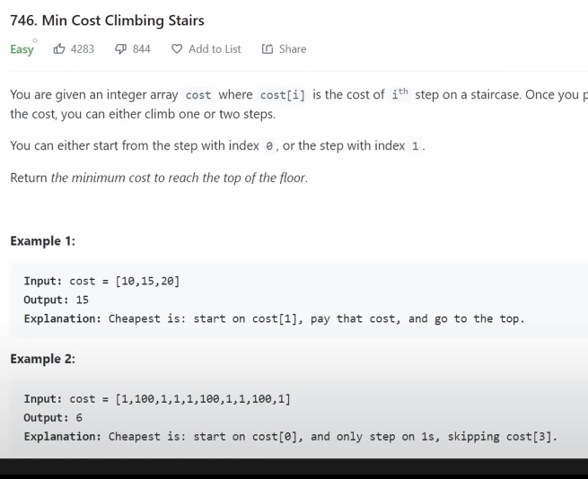

- climb one or two steps
  - 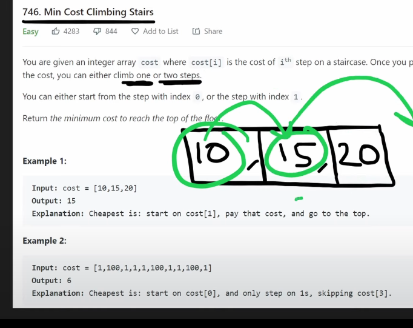
    - jump from 10+15 = 25
    - jump from 15+0= 15

### Brute force: 2^n with cache O(n)

- start from index: 0
  - 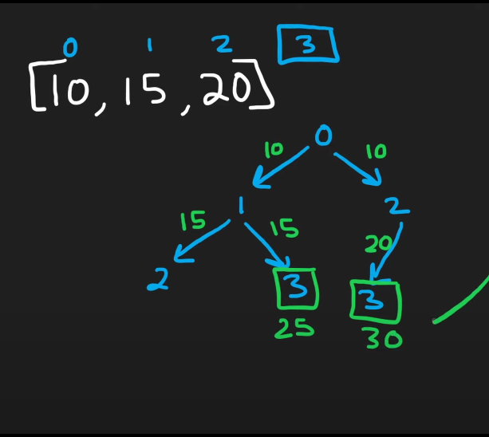
- start from index: 1
  - 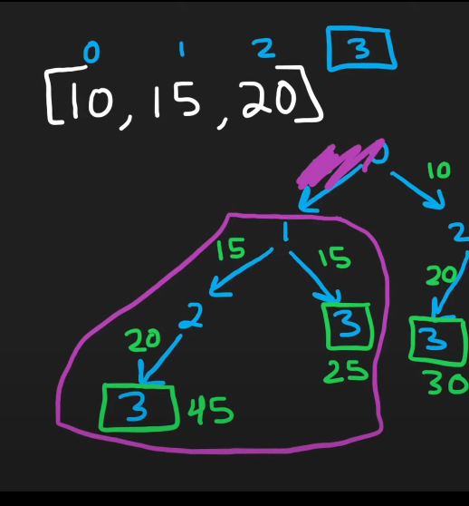

## DP solution

- use two single variables
  - 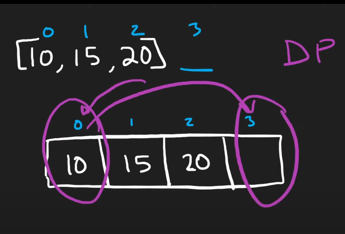
  - 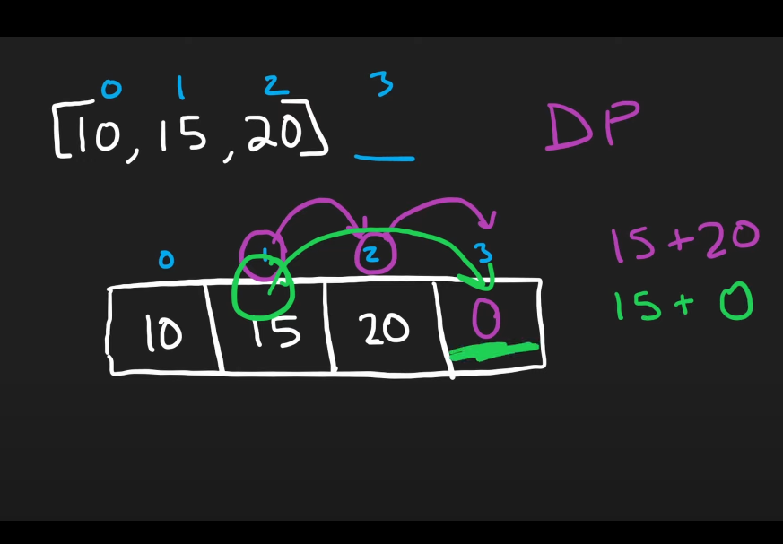
  - 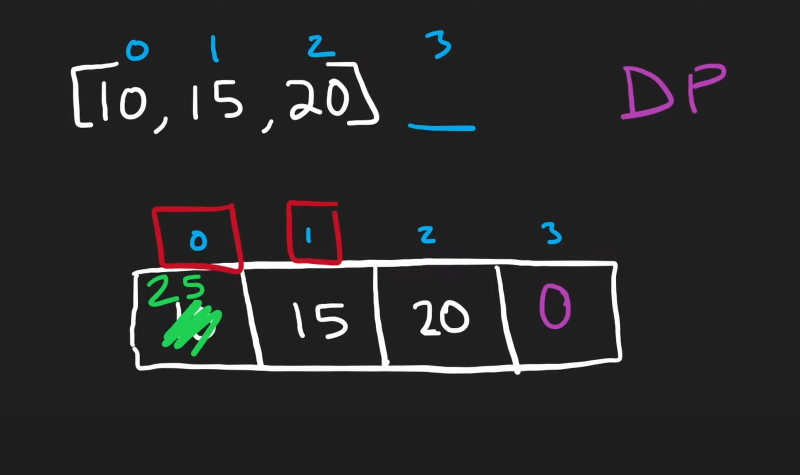
  - return the minimum of first 2 values

<details>
<summary>Solution</summary>
<br>
<!-- We need a space between the <br> and the content -->

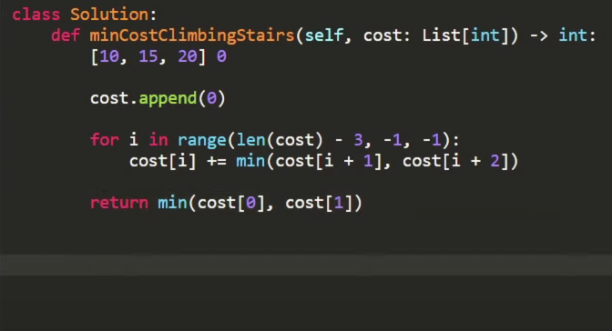

</details>

## House Robber

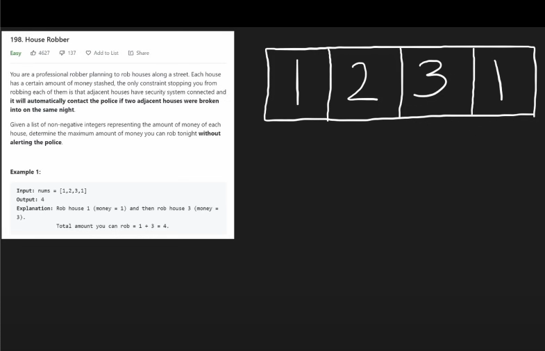

- cannot rob neighbor next to each other

### Brute force

- 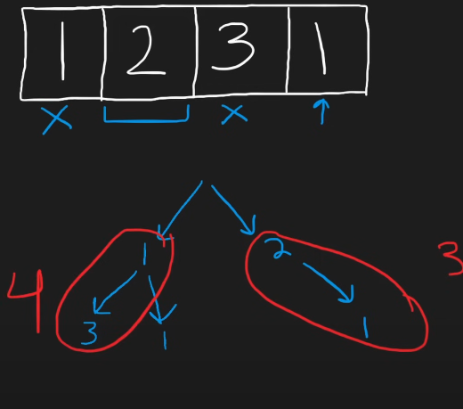

## Subproblems

- recurrence relationship
  - 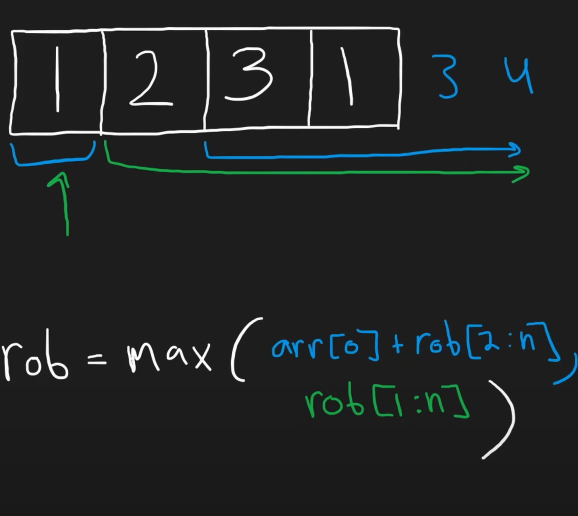
  - rob house 1 or house 2
    - 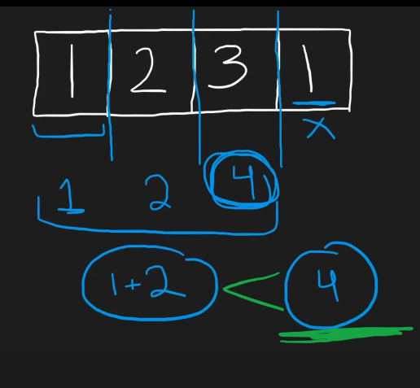
  - maintain last two rob sum

<details>
<summary>Solution</summary>
<br>
<!-- We need a space between the <br> and the content -->

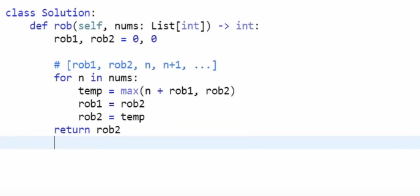

</details>

## House Robber II

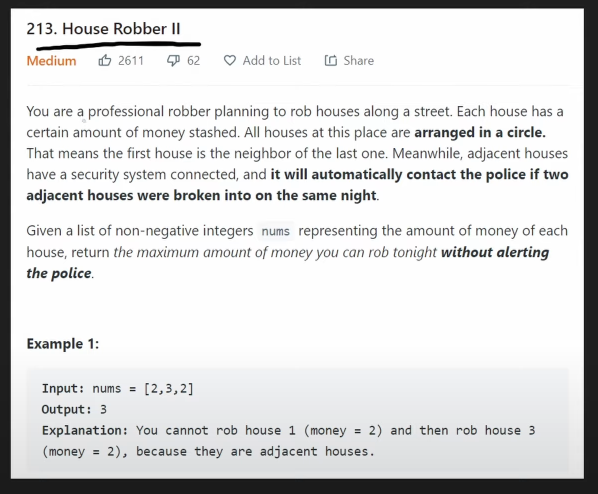

- we can't rob house in adjacent
- first and last house is adjacent/connected
- 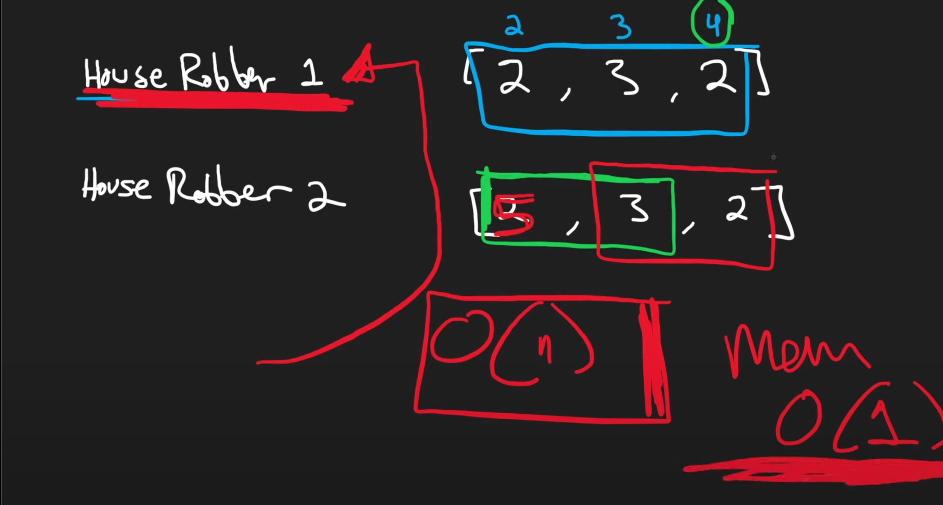

<details>
<summary>Solution</summary>
<br>
<!-- We need a space between the <br> and the content -->

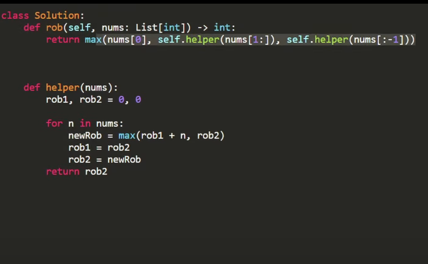

</details>

## Longest Palindromic Substring

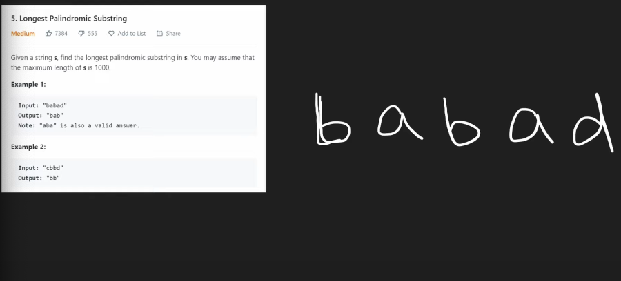

- palindrome write in reverse its the same string
  - expand outwards
  - 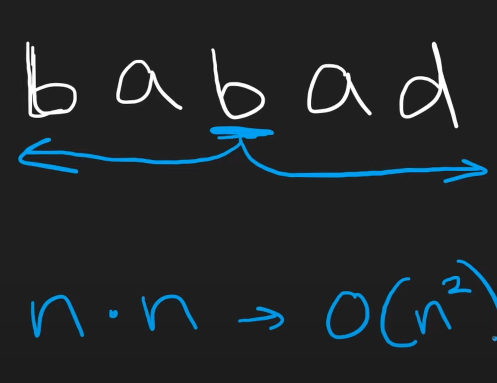

<details>
<summary>Solution</summary>
<br>
<!-- We need a space between the <br> and the content -->

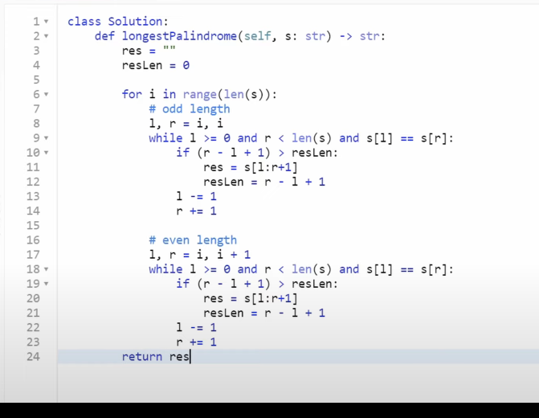

</details>
